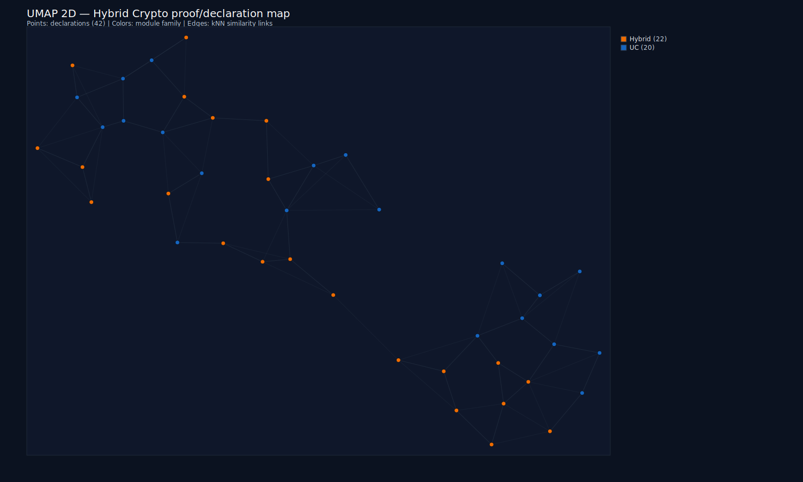
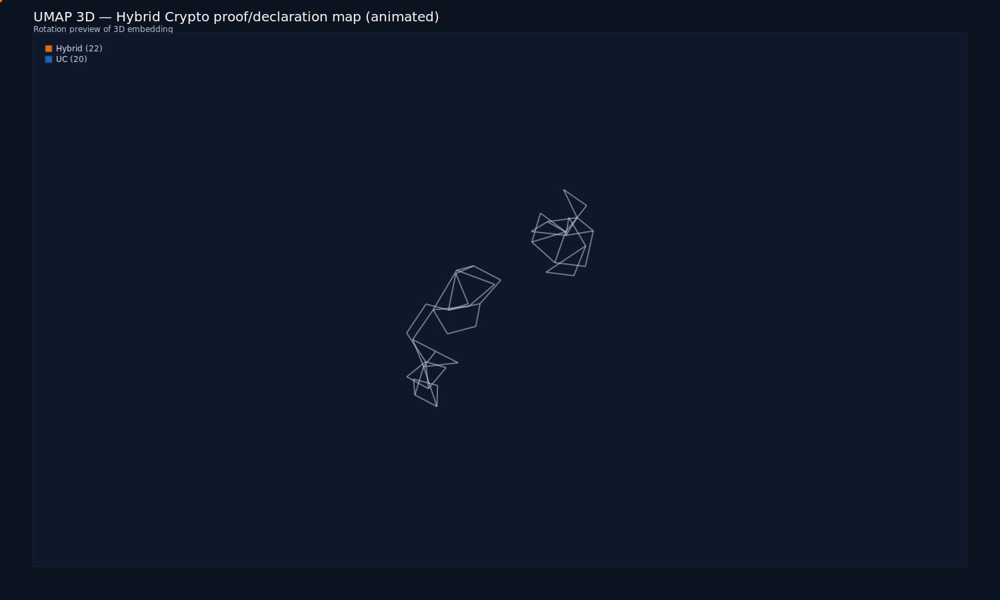
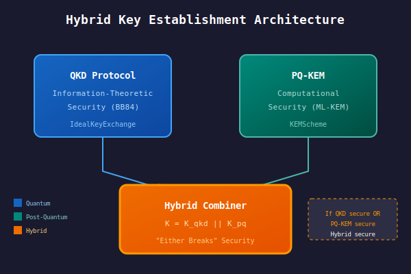
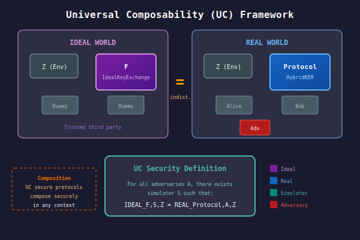

# Hybrid Crypto: QKD + Post-Quantum KEM

<p align="center">
  <strong>Machine-checked formalization of hybrid key establishment combining QKD and PQ-KEM</strong><br/>
  <em>
    Lean 4 formalization of composable hybrid cryptographic protocols: UC-style key exchange,
    hybrid KEM combiners (X-Wing style), and interface-first security specifications
  </em>
</p>

<p align="center">
  
  
  
  
</p>

---

Part of the broader HeytingLean formal verification project: https://apoth3osis.io

## Results (One Story)

This repo mechanizes hybrid key establishment protocols that combine **information-theoretic** security (QKD) with **computational** security (post-quantum KEMs):

1. **Hybrid KEM Combiner**: Product/parallel composition of two KEMs with "either assumption implies security" property.
2. **QKD + PQ Hybrid**: Interface-first specification combining UC-style ideal key exchange with PQ KEM shared secrets.
3. **UC Composable Framework**: Lightweight universal composability scaffold supporting protocol composition.

**Key insight**: If *either* the QKD component OR the PQ-KEM component remains secure, the hybrid provides security. This "either breaks" property is critical for quantum-safe transition.

---

## Architecture Visualized

<table>
<tr>
<td align="center" width="50%">

<br/><strong>2D Proof Map (UMAP)</strong><br/>
<em>Pan, zoom, search declarations</em>
</td>
<td align="center" width="50%">

<br/><strong>3D Proof Map (animated)</strong><br/>
<em>Rotate, zoom, explore clusters</em>
</td>
</tr>
<tr>
<td align="center">

<br/><em>Hybrid architecture: QKD + PQ-KEM composition</em>
</td>
<td align="center">

<br/><em>UC composable security model</em>
</td>
</tr>
</table>

---

## What's Formalized

| Component | Description |
|-----------|-------------|
| **KEMScheme** | Abstract KEM interface: keygen, encaps, decaps |
| **hybridKEM** | Product combiner: run both KEMs, pair ciphertexts/secrets |
| **KeySource** | Abstract key material source (for QKD modeling) |
| **hybridKeySource** | Hybrid key source combiner |
| **IdealFunctionality** | UC ideal functionality interface |
| **Protocol / Simulator** | UC protocol and simulator abstractions |
| **UCSecure** | UC security predicate (real/ideal indistinguishability) |
| **IdealKeyExchange** | Ideal key exchange functionality F_KE |
| **HybridKEM (struct)** | QKD key + PQ ciphertext + shared secret bundle |
| **HybridSecure** | "Either breaks" hybrid security predicate |

### Security Theorems

| Theorem | Statement |
|---------|-----------|
| `hybrid_security_of_left` | IND-CCA(K1) → IND-CCA(hybridKEM K1 K2) |
| `hybrid_security_of_right` | IND-CCA(K2) → IND-CCA(hybridKEM K1 K2) |
| `hybrid_security_of_or` | (IND-CCA K1 ∨ IND-CCA K2) → IND-CCA(hybridKEM K1 K2) |
| `hybridKey_security_of_or` | (KeySecure S1 ∨ KeySecure S2) → KeySecure(hybridKeySource S1 S2) |
| `hybrid_security` | (UCSecure F_KE π ∨ PQSecure K) → HybridSecure π K |

---

## Quick Start

### Verify Everything (One Command)

```bash
cd RESEARCHER_BUNDLE
./scripts/verify_hybrid.sh
```

This runs strict builds (`--wfail`), verifies no `sorry` statements, and runs sanity tests.

### Build Library Only

```bash
cd RESEARCHER_BUNDLE
lake build HeytingLean --wfail
```

### Run Sanity Tests

```bash
cd RESEARCHER_BUNDLE
lake build HeytingLean.Tests.Crypto.HybridSanity --wfail
```

---

## Key Theorems

```lean
-- Hybrid KEM: either component secure → hybrid secure
theorem hybrid_security_of_or (K1 K2 : KEMScheme) :
    (IND_CCA K1 ∨ IND_CCA K2) → IND_CCA (hybridKEM K1 K2)

-- Hybrid key source: either source secure → hybrid secure
theorem hybridKey_security_of_or (S1 S2 : KeySource) :
    (KeySecure S1 ∨ KeySecure S2) → KeySecure (hybridKeySource S1 S2)

-- QKD + PQ hybrid: either component secure → hybrid secure
theorem hybrid_security {n : Nat}
    (πqkd : Protocol (Instances.IdealKeyExchange n)) (K : KEMScheme) :
    (UCSecure (Instances.IdealKeyExchange n) πqkd ∨ PQSecure K) →
      HybridSecure (πqkd := πqkd) K

-- UC composition (kit-based)
def uc_composition {F₁ F₂ : IdealFunctionality} (kit : CompositionKit F₁ F₂)
    {π₁ : Protocol F₁} {π₂ : Protocol F₂}
    (h₁ : UCSecure F₁ π₁) (h₂ : UCSecure F₂ π₂) (h_uses : kit.UsesSubroutine π₂) :
    UCSecure F₂ (kit.compose π₂ π₁)
```

---

## Interface-First Design (Important Note)

This formalization follows an **interface-first** approach:

- Security predicates (`IND_CCA`, `KeySecure`, `PQSecure`) are currently **placeholders** (`True`)
- The theorems establish the *structure* of security reductions
- Real security guarantees require replacing placeholders with game-based definitions

**Why this matters**: The interface contracts and composition patterns are verified. When concrete game definitions are added (tracked via conjectures), the security reductions will carry real cryptographic meaning.

**Open conjectures** (tracked in `conjectures/`):
- `kem_indcca_game.json`: Replace `IND_CCA` with game-based definition
- `uc_game_bridge.json`: Ground `UCSecure` in explicit game notion

---

## Axiom Footprint

The formalization uses only standard Lean kernel axioms:

| Axiom | Purpose |
|-------|---------|
| `propext` | Propositional extensionality |
| `Classical.choice` | Axiom of choice |
| `Quot.sound` | Quotient soundness |

**No project-specific axioms introduced.**

---

## Documentation

| File | Description |
|------|-------------|
| `01_Lean_Map.md` | Concept → Lean mapping |
| `02_Proof_Index.md` | What's proved and where |
| `03_Reproducibility.md` | Build/run commands |
| `04_Dependencies.md` | Lean/mathlib pins |
| `05_Technical_Report.md` | Technical summary |
| `06_Axiom_Audit.md` | Axiom/assumption audit |

---

## Repository Structure

```
├── README.md                 # This file
├── .nojekyll                 # GitHub Pages helper
├── index.html                # GitHub Pages landing
├── 0[1-6]_*.md               # Documentation
├── artifacts/                # Static artifacts (SVG graphs)
├── conjectures/              # Open proof targets
│   ├── kem_indcca_game.json
│   └── uc_game_bridge.json
└── RESEARCHER_BUNDLE/
    ├── README_VERIFY.md              # One-command verification
    ├── lean-toolchain               # Lean pin
    ├── lakefile.lean                # Lake package
    ├── lake-manifest.json           # Locked dependencies
    ├── HeytingLean/                 # Lean sources
    │   ├── Crypto/
    │   │   ├── Hybrid/QKDPQHybrid.lean
    │   │   ├── KEM/HybridKEM.lean
    │   │   └── Composable.lean
    │   ├── Security/Composable/
    │   └── Tests/Crypto/HybridSanity.lean
    ├── scripts/                     # verify_hybrid.sh
    ├── artifacts/
    │   └── visuals/                 # 2D/3D UMAP previews
    └── reports/                     # Build transcripts
```

---

## References

1. Schwabe, P. et al. (2024). "[X-Wing: The Hybrid KEM You've Been Looking For](https://eprint.iacr.org/2024/039)." *IACR ePrint 2024/039*

2. IETF. "[Hybrid Key Exchange in TLS 1.3](https://datatracker.ietf.org/doc/draft-ietf-tls-hybrid-design/)." *IETF Draft*

3. Canetti, R. (2001). "[Universally Composable Security](https://eprint.iacr.org/2000/067)." *FOCS 2001*

4. NIST. "[Post-Quantum Cryptography Standardization](https://csrc.nist.gov/projects/post-quantum-cryptography)." *NIST PQC Project*

---

<p align="center">
  <em>Part of the <a href="https://apoth3osis.io">HeytingLean</a> formal verification project</em>
</p>
